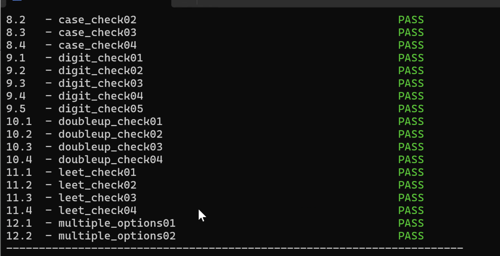

# CSSE2310
- 985硕，前字节跳动、华为程序员，专业辅导，包教包会，耐心可靠。
- 无查重风险，代码简洁易懂。
- wx: hysteria00544 
## 2024 Semester 2 A1 Uqentropy
计算密码强度，两种计算方式，简单的字符串比较和文件读取。

## A2 GDB调试
- 条件断点
- 字符串拼接
- 如果是函数，在进入函数时先全部打印出来，然后找到对应的序列。
- 注意：后面几个函数之间有关联性